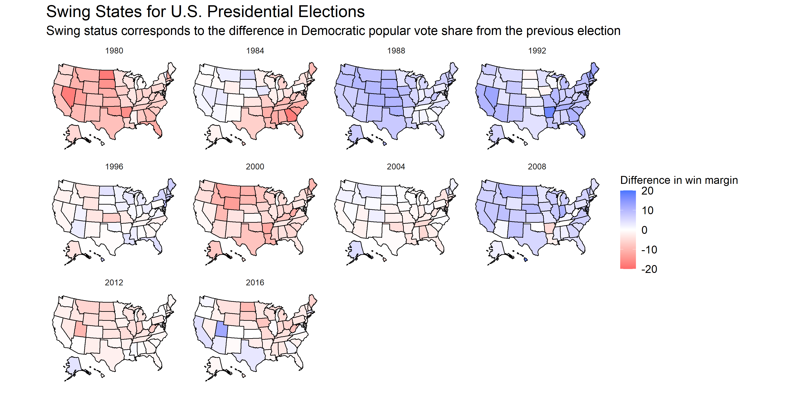

This article seeks to explore two different methods of calculating the degree of a state's "swing".

## Difference between State and National Polls

## Predicting Elections

## Predicting 2020

## Swing over time

*You can find the replication scripts for graphics included in this week's blog [here](https://github.com/caievelyn/election-analytics/blob/master/scripts/2019_09_27_script.R). You can find the necessary data [here](https://github.com/caievelyn/election-analytics/tree/master/data).*
