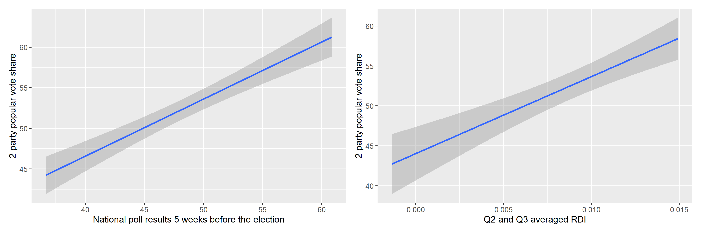

## Weighted Ensembles
Let's combine what we've learned in previous blog posts, including that the average Q2 and Q3 RDI growth is a strong predictor of Democratic 2-party vote share (Democrat or Republican does not matter since both sum to 1 in this case) and that polls generally converge towards the actual election outcome as November 3rd approaches. We can construct a weighted ensemble model, which treats the prediction generated from polls as an estimate distinct from the prediction generated from economic indicators. In order to empirically calculate the appropriate weights for each category, I conducted a sensitivity analysis for predictions in the years 2008, 2012, and 2016. The results are below.

The answer is no. In fact, the map above illustrates the difference between the closest poll to the election and the actual election outcome, by state. The only state that had a noticeably higher Republican vote share compared to its polling was Tennessee, a state that was not quite contentious to begin with. This map illustrates two points: Firstly, that 2016 was not an anomalous year in that close polling to the election was abnormally inaccurate. Looking back at previous years, even for those with missing data, it seems like the predictive power of polls have increased over time. We can attribute this to factors such as improved weighting techniques and larger and more truly representative samples. The second point illustrated by this map is that the actual Democratic vote share seemed to be higher than predicted in many states.

This map also leads to the question: How accurate are polls in predicting election outcomes? We've examined general trends over time, but what of their predictive power overall? Below, I consider two prominent election analysts and their models.

## The Economist v. 538
The showoff between the Economist and 538 is essentially a battle of fundamental and uncertainty indicators. The first, from Elliott Morris of The Economist, relies on a number of fundamental factors that contextualize a presidential race that cannot be changed ([Morris, 2020](https://projects.economist.com/us-2020-forecast/president/how-this-works)). These factors include a blend of economic indicators such as Real Disposable Income growth, payrolls, and stock market growth. The partisan lean of states, rather than absolute vote share, is calculated to take into consideration the winner-takes-all electoral college system. Morris is also careful to weigh polls less and treats them with a dose of skepticism due to their weak ability to predict elections until quite close to the election day.

Meanwhile, 538's model, especially for 2020, revolves around accounting for uncertainty: uncertainty in voter turnout due to COVID-19, economic uncertainty, and uncertainty as to what any of these variables may spell out for the election ([Silver, 2020](https://fivethirtyeight.com/features/how-fivethirtyeights-2020-presidential-forecast-works-and-whats-different-because-of-covid-19/)). 538 weighs polls more heavily in its weighted ensemble model than The Economist's model.

I personally believe that The Economist's model and its reliance more on fundamentals than variable polling is a more reliable measure. It makes sense that polls taken closer to the election are more powerful predictors. However, I believe that the substantive benefit of understanding what may happen 6 months before the actual election occurs is invaluable. Many parties - foreign governments, families and U.S. residents, and corporations are all impacted by the election outcome. Because fundamentals are such strong predictors earlier than polls are, I believe in the predictive power of the Economist's modelling more.

After testing a polls-only, fundamentals-only, and simple combined linear model, I found R^2 to be 0.979 for the combined model compared to R-squared values around 0.62 and 0.64 for the fundamental and polls models, respectively. This is alarming and most certaintly points to overfitting. The error term around the averaged RDI for Q2 and Q3 was actually larger than that of the polls model, also taken at a similar 5 weeks before the election. Through these experiments, it is clear that some sort of weighted ensemble would be a better predictor than using polls and economic indicators in isolation. In the following weeks, I hope to refine my model through using a weighted ensemble that more strongly relies upon consistent fundamentals and nuances the prediction with poll results that will continuously become more convergent with the true election outcome.

*You can find the replication scripts for graphics included in this week's blog [here](https://github.com/caievelyn/election-analytics/blob/master/scripts/2019_09_27_script.R). You can find the necessary data [here](https://github.com/caievelyn/election-analytics/tree/master/data).*
