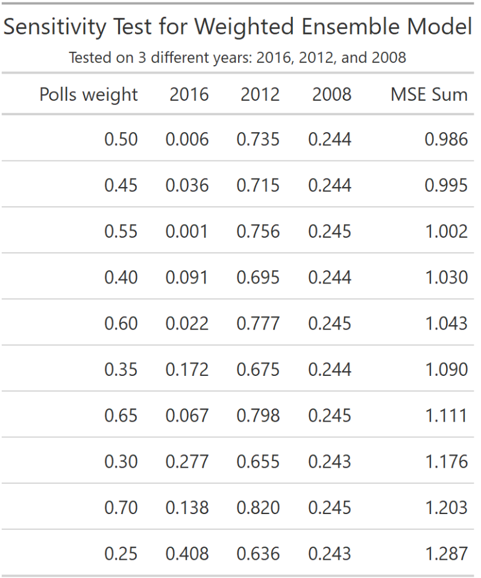
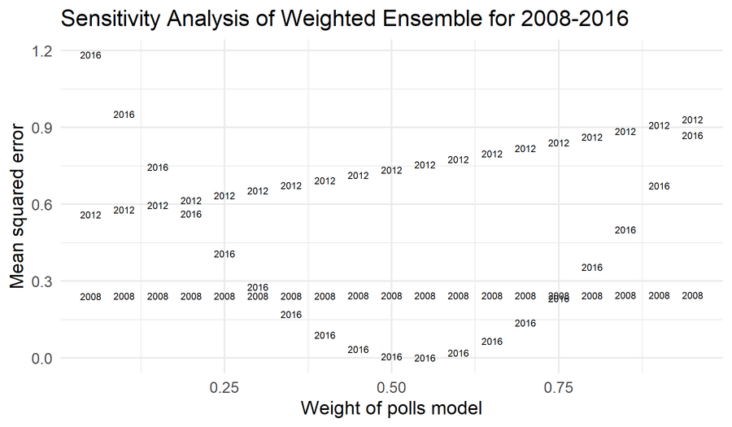
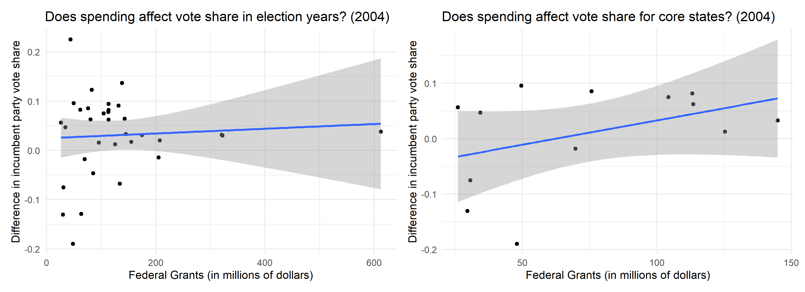
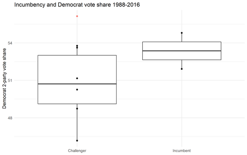

## Weighted Ensembles
Let's combine what we've learned in previous blog posts, including that the average Q2 and Q3 RDI growth is a strong predictor of Democratic 2-party vote share (Democrat or Republican does not matter since both sum to 1 in this case) and that polls generally converge towards the actual election outcome as November 3rd approaches. We can construct a weighted ensemble model, which treats the prediction generated from polls as an estimate distinct from the prediction generated from economic indicators. In order to empirically calculate the appropriate weights for each category, I conducted a sensitivity analysis for predictions in the years 2008, 2012, and 2016. The results are below.

Simply summing the mean squared errors reveals that the 50-50 split for weighting the polls model and the economic indicators model yields the least summed mean square error. Below, the relationship of MSE and weighting is shown; it seems that the 50-50 split in weighting is a strong predictor for the 2016 election compared to the 2008 and 2012 elections.

## Incumbency importance
Incumbency matters. While voters have no underlying preference for incumbents once other factors are controlled for, the reality is that their time in office confers benefits to their election ([Brown, 2014](https://www-cambridge-org.ezp-prod1.hul.harvard.edu/core/services/aop-cambridge-core/content/view/ECFE39E003912F8AF65C2AD14A34BD8C/S2052263014000062a.pdf/div-class-title-voters-don-t-care-much-about-incumbency-div.pdf)). There are a variety of mechanisms in which incumbency can influence the incumbent party's vote share, including increased salience among voters and the ability to prove competence to voters employing retrospection to inform their vote choice. One of the more documented measures is financial benefits from the association of federal spending with the incumbent. Residents reward sitting presidents for spending in their area, presumably because the spending indicates future prosperity under the President ([Kriner & Reeves, 2012](https://www-cambridge-org.ezp-prod1.hul.harvard.edu/core/services/aop-cambridge-core/content/view/D7E15E901EA52BF92E5986626766224F/S0003055412000159a.pdf/div-class-title-the-influence-of-federal-spending-on-presidential-elections-div.pdf)).

I wanted to take a look at how this might affect the change in incumbent vote share. In order to do so, I looked at one specific year - 2004 - and calculated the difference in the incumbent party's 2-party vote share and the incumbent party's average vote share for the past 3 elections.

Confirming Kriner & Reeves' (2012) results, there is a weak positive correlation between grant spending and the difference in incumbent party vote share. When subsetting only for core election states, the relationship becomes much more clear and the correlation strengthens. The implications on our model are twofold: 1) Incumbency matters and we need to incorporate it, and 2) If federal spending is taken into account, so should whether the states are "core" battleground states or not.

## Bringing it together
In this case, let's add a binary variable that codes for incumbency. We'll go through the same process of determining the proper weights for the three components of the model as described above. Upon running the sensitivity analysis, it seems that a weighted ensemble may not be appropriate for including incumbency. Because it is a binary variable and therefore encodes very little information, even assigning a weight of 0.1 to incumbency and weights of 0.45 to polls and RDI growth leads to an extremely large MSE of 25.

Creating a multivariate linear regression model using incumbency, averaged RDI growth over Q2 and Q3, and average support with 30 days left from the election, we get the following specifications: An R^2 of 0.77 and a mean squared error 1.55, which is validated through leave-one-out cross-validation (with revised R^2 at 0.52 and MSE of 1.98). Keeping in mind that this model predicts Democratic vote share, I used it to give an updated prediction of the 2020 election. 

Biden is predicted to have 56% of the 2-party vote share, as represented by the red dot above. Going forward, it will be interesting to see how recent events, such as the debate and Trump's COVID-19 diagnosis, do or do not change the polls.

*You can find the replication scripts for graphics included in this week's blog [here](https://github.com/caievelyn/election-analytics/blob/master/scripts/2019_10_04_script.R). You can find the necessary data [here](https://github.com/caievelyn/election-analytics/tree/master/data).*
