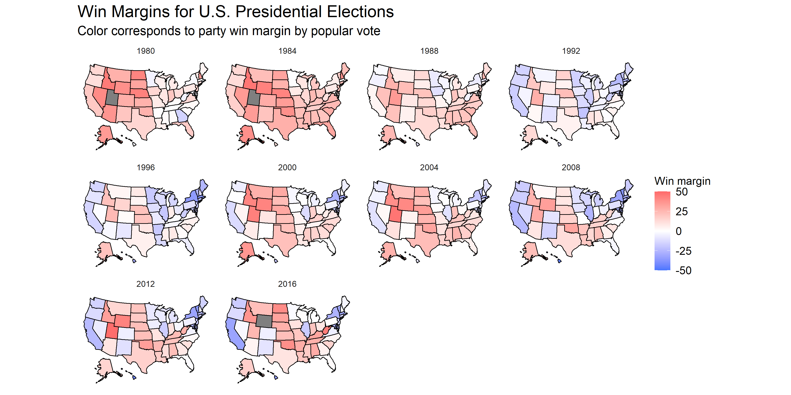
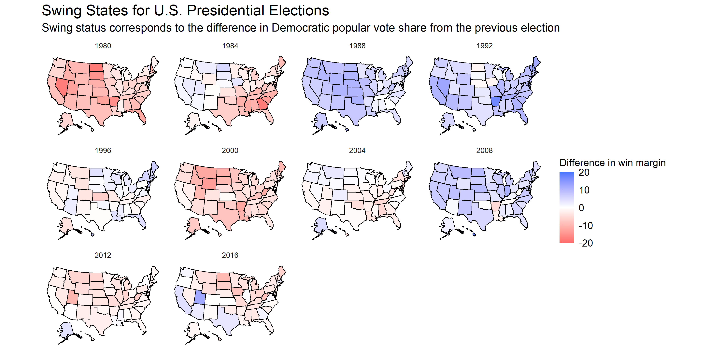

This article seeks to explore two different methods of calculating the degree of a state's "swing".

## Popular Vote Win Margins

Let's first begin with popular vote win margins for two parties. These win margins are calculated by taking the difference in two parties' vote share per election, and indicate how "close" the election was.

First, we can take note of some high-level trends. In the years 1980 and 1984, most states are colored red, indicating that the popular vote favored the Republican party. In these years, President Ronald Reagan first defeated Democratic incumbent Jimmy Carter and then defeated Walter Mondale, who served as Carter's Vice President. Some states have consistently demonstrated comfortable win margins for a certain party, such as Oklahoma from 1980 onwards or California after the 1988 election. Meanwhile, the white- or faintly- colored states represent "swing" states in the manner that they are commonly understood: as states whose outcomes have the ability to affect electoral college votes, and thus the overall general election ([FiveThirtyEight](https://fivethirtyeight.com/features/arizona-is-probably-not-a-swing-state/)).

Swing states in this sense are important because all but 2 states - Maine and Nebraska - implement a winner-takes-all system in which 100% of the electoral votes go towards the popular vote winner ([National Archives](https://www.archives.gov/electoral-college/allocation)). The 2000 and 2016 elections were controversial due to the difference between the popular vote winner and the electoral college winner. Following the 2016 election upset, widespread criticism of the electoral college set aside logistical concerns about amending the Constitution. In fact, Democratic nominee candidate Elizabeth Warren called for an abolition of the electoral college ([Elizabeth Warren](https://elizabethwarren.com/plans/electoral-college)). So, does this mean that the electoral college is crooked?

Not necessarily. Due to the winner-takes-all system, a candidate can have a very small popular vote win margin and still take the electoral votes for that state. According to the [Washington Post](https://www-washingtonpost-com.ezp-prod1.hul.harvard.edu/graphics/politics/2016-election/swing-state-margins/), six states saw Trump win by less than a 2% margin. Across these six states, there are 89 electoral votes - meaning that, had the popular vote differed, Hillary Clinton could have won the 2016 election.

## Swing over time

Another definition of "swing" can be calculated by the difference in partisan vote capture from election to election. As mentioned before, the states with consistently positive win margins for a certain party would not be considered "high" in swing under this definition. 

This map is consistent with historical records - in 2000, an election year that a Democratic President replaced a Republican incumbent, the map is generally blue. However, we must be careful about generalizing the opposite of this relationship. For example, in 1988, one might expect that a Democrat defeated a Republican incumbent because of the similarities to the 2000 map. In fact, a Republican - President George H. W. Bush - defeated the Democratic candidate. In this case, we must be careful about reading the plot as a *difference between Democratic vote share from the last election*, rather than the general win margin. Although Bush won the candidacy, he did so with a smaller win margin (~7.7) compared to the 1984 election, in which Reagan won by ~18.2 points.
