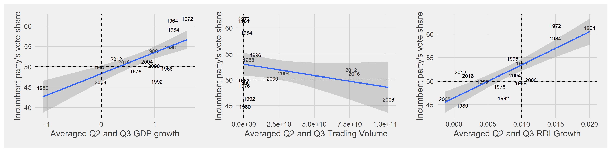
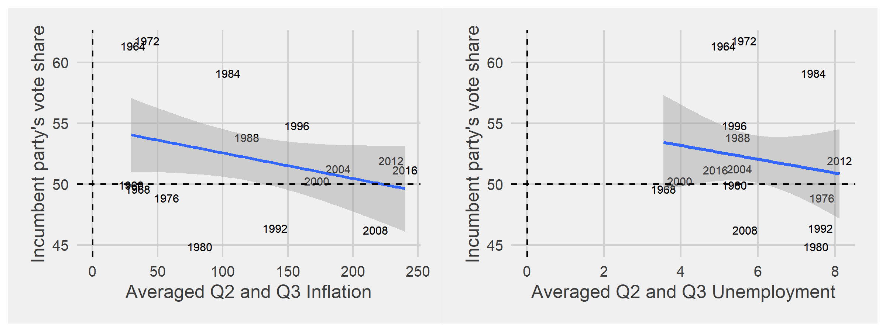

## Voting out of one's pocketbook or for the greater good?

It comes as no surprise that there is a strong correlation between an incumbent's vote share and how well the economy did under their term ([Achen & Bartels, 2017](https://www.jstor.org/stable/j.ctvc7770q)). Various explanations exist for why voters reward good economic performance and punish the bad. For example, voters could simply lack the knowledge and initiative to obtain other information to judge the sitting President on. Or, the economy could serve as a close proxy to other variables that might measure general well-being under an incumbent's term.

Regardless, economic information is generally consistent and widely reported. As such, it interests us as to how voters conceptualize economic performance. Do they care about the economy because it directly reflects what's happening at home - perhaps high unemployment rates that personally affected a family member? In other words, do they care about **pocketbook voting**, or individual-level standards of economic well-being? Or, do voters care about national indicators such as GDP and real disposable income growth more? These national-level indicators may reflect incumbent economic competency or the general state of the country. It's difficult to separate out which factors might be considered pocketbook or sociotropic when the indicators in our dataset are all national-level.

Presumably, factors that may not tie in directly to a person's day-to-day economic experience (GDP, stock volume) can be considered more sociotropic. Meanwhile, factors that may tie in more closely include unemployment, real disposable income, and inflation. Again, this blog post uses all national-level data. To truly further dissect the debate over pocketbook vs. sociotropic voting, disaggregating indicators at the local level will be more revealing.

## Constructing models

In aggregate, voters overwhelmingly tend to measure the entire 4-year economic performance based off of the last two years, especially the last two quarters of election year([Healy & Lenz, 2013](https://onlinelibrary.wiley.com/doi/abs/10.1111/ajps.12053)). Again, various factors could be at play: purposeful discounting of the past, falling prey to an inaccurate end-heuristic, or simply bad memory. For this reason, the models constructed in the next section will look at averaged Quarter 2 and 3 numbers for the election year.

## Comparing Models

## 2020 Prediction

Because 2020 Q3 has not concluded yet, I am predicting based off of Q2 data solely. 

*You can find the replication scripts for graphics included in this week's blog [here](https://github.com/caievelyn/election-analytics/blob/master/scripts/2019_09_20_script.R). You can find the necessary data [here](https://github.com/caievelyn/election-analytics/tree/master/data).*
