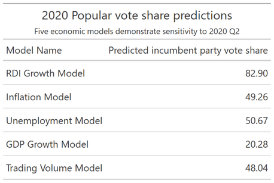

## Voting out of one's pocketbook or for the greater good?

It comes as no surprise that there is a strong correlation between an incumbent's vote share and how well the economy did under their term ([Achen & Bartels, 2017](https://www.jstor.org/stable/j.ctvc7770q)). Various explanations exist for why voters reward good economic performance and punish the bad. For example, voters could simply lack the knowledge and initiative to obtain other information to judge the sitting President on. Or, the economy could serve as a close proxy to other variables that might measure general well-being under an incumbent's term.

Regardless, economic information is generally consistent and widely reported. As such, it interests us as to how voters conceptualize economic performance. Do they care about the economy because it directly reflects what's happening at home - perhaps high unemployment rates that personally affected a family member? In other words, do they care about **pocketbook voting**, or individual-level standards of economic well-being? Or, do voters care about national indicators such as GDP and real disposable income growth more? These national-level indicators may reflect incumbent economic competency or the general state of the country. It's difficult to separate out which factors might be considered pocketbook or sociotropic when the indicators in our dataset are all national-level.

Presumably, factors that may not tie in directly to a person's day-to-day economic experience (GDP, stock volume) can be considered more sociotropic. Meanwhile, factors that may tie in more closely include unemployment, real disposable income, and inflation. Again, this blog post uses all national-level data. To truly further dissect the debate over pocketbook vs. sociotropic voting, disaggregating indicators at the local level will be more revealing.

## Constructing models

In aggregate, voters overwhelmingly tend to measure the entire 4-year economic performance based off of the last two years, especially the last two quarters of election year ([Healy & Lenz, 2013](https://onlinelibrary.wiley.com/doi/abs/10.1111/ajps.12053)). Again, various factors could be at play: purposeful discounting of the past, falling prey to an inaccurate end-heuristic, or simply bad memory. For this reason, the models constructed in the next section will look at averaged Quarter 2 and 3 numbers for the election year. I chose to take the average of these two quarters instead of solely looking at Q2, as the R2 values for each model were lower in the latter case than in the former.

#### OLS Linear Regression on Different Economic Indicators

As you can see from above, certain indicators have less standard errors, such as Real Disposable Income growth and GDP growth (to a lesser extent). This gives us more confidence in their predictive power. Indeed, real disposable income growth has been found to be the more accurate predictor([Achen & Bartels, 2017](https://www.jstor.org/stable/j.ctvc7770q)). In the next section, I will check the in-sample variation statistics and test the fit of the data through cross-validation.

## Comparing Models

Here, it can be seen that the arguably more "pocketbook" measure of RDI growth can explain about 63% of the variation in incumbent party's vote share. The next best model is the GDP Model. The other pocketbook models based on unemployment and inflation have relatively little predictive power.

Using the `tidymodels` R package to conduct 5-fold cross validation, I verified the in-sample variation of the RDI Model. Because of our small sample size (*n* = 30), I chose to repeat the cross validation 10 times with random subsets of 5 folds of the data. Indeed, I found similar values for MSE (3.21 with a standard deviation of 0.09) and R2 (0.617 with a standard deviation of 0.04).

## 2020 Prediction

Because 2020 Q3 has not concluded yet, I am predicting based off of Q1 and Q2 averaged data. Once Q3 data becomes available in a few short weeks, I will update my data.

As you can see, our predictive models are highly sensitive to the 2020 Q1 and Q2 economic indicators because of their extreme values. RDI growth in the second quarter can be explained to the government's increase in personal transfers in response to the COVID-19 pandemic. Meanwhile, GDP growth hit an all-time low for President Trump's term - and in fact, an all-time low for a quarterly contraction ([CNBC](https://www.cnbc.com/2020/07/30/us-gdp-q2-2020-first-reading.html)). This year is particularly dicey because of COVID-19 related economic shocks; will people be swayed more by the fact that they have more real disposable income in Q2 compared to Q1? Or will they be swayed by the sociotropic concern that the economy is faring poorly in general? While existing literature points to the fact that voters tend to vote sociotropically, it will be interesting to see how this observation holds up in the era of COVID-19.

These results lead to 2 future steps:
1) Including economic *and* non-economic variables in predictive models, as there is still unexplained variation in incumbent party vote share, and
2) Creating models that may contain a mix of economic indicators.

*You can find the replication scripts for graphics included in this week's blog [here](https://github.com/caievelyn/election-analytics/blob/master/scripts/2019_09_20_script.R). You can find the necessary data [here](https://github.com/caievelyn/election-analytics/tree/master/data).*
