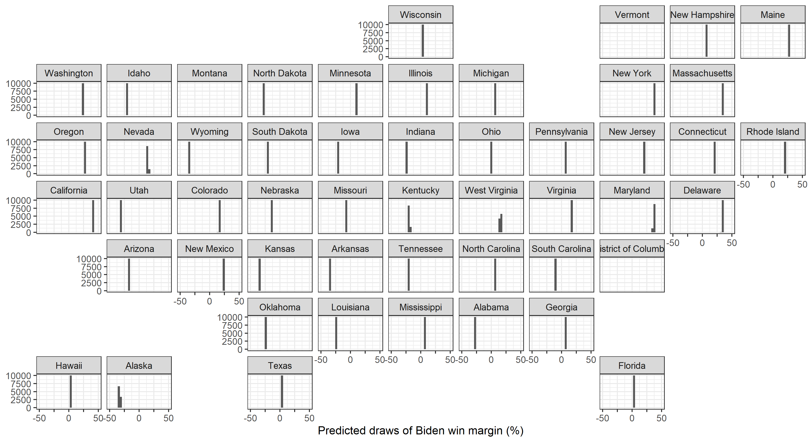
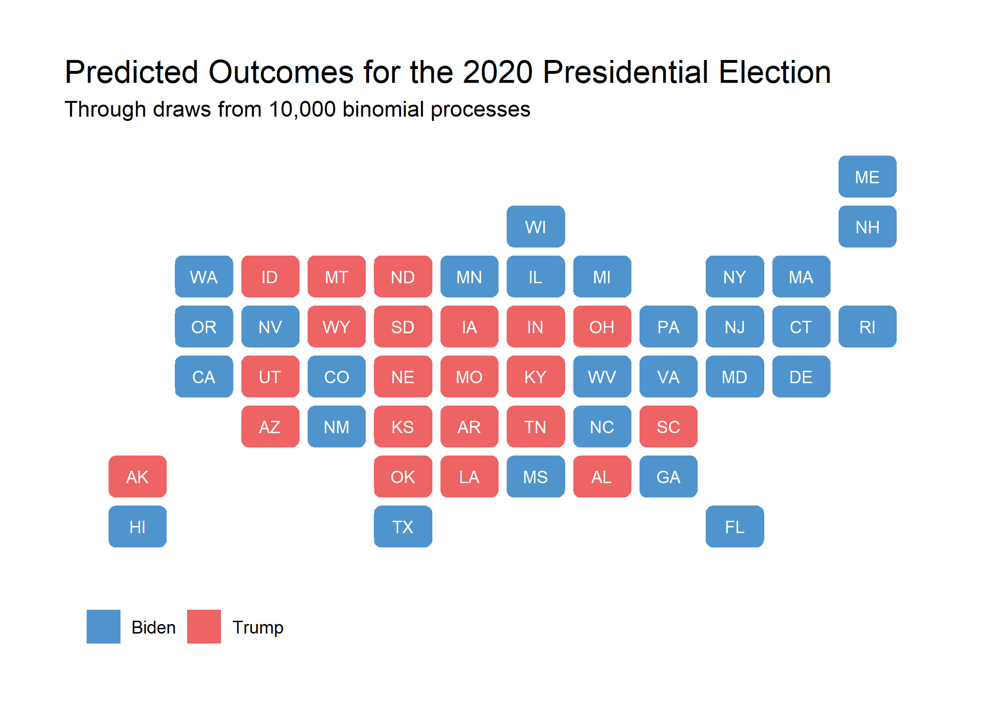

The two goals of this week's blog post are as follow. Firstly, I would like to explore the mechanisms through which political advertising affects election outcomes and the implications for the 2020 election based off of partial advertising data. Next, I will construct a binomial logit probabilistic model and display the anticipated results of the 2020 election based off of 10,000 simulations using this binomial process.

## Political Advertising

## Probabilistic Predictive Model

*You can find the replication scripts for graphics included in this week's blog [here](https://github.com/caievelyn/election-analytics/blob/master/scripts/2020_10_11_script.R). You can find the necessary data [here](https://github.com/caievelyn/election-analytics/tree/master/data).*
