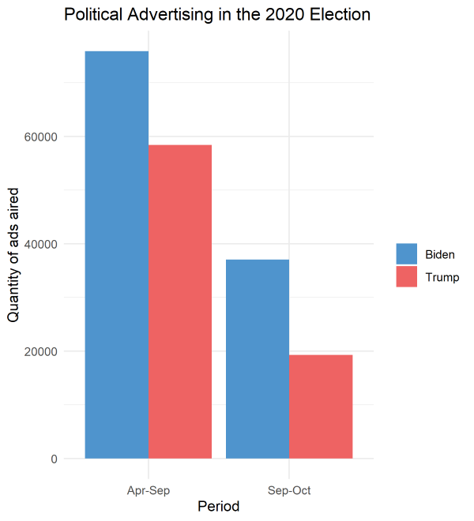

2020 is certainly an extraordinary year, and there are many new and existing factors that may contribute to the election outcome. While demographic voting blocs have always been of interest, prediction is complicated by issues in turnout and a damepened ground game due to COVID-19 restrictions. As such, this blog post will explore the ground game, voter turnout, and demographic variables to determine which factors are most salient for the 2020 presidential election.

## The Ground Game

## Demographics

## Turnout

*You can find the replication scripts for graphics included in this week's blog [here](https://github.com/caievelyn/election-analytics/blob/master/scripts/2020_10_18_script.R). You can find the necessary data [here](https://github.com/caievelyn/election-analytics/tree/master/data).*
