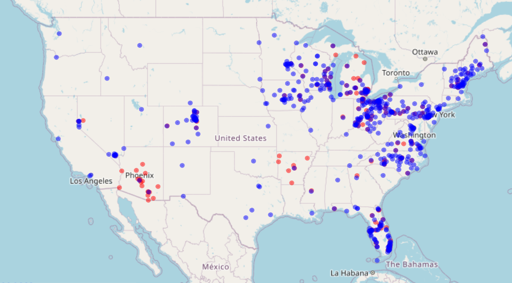
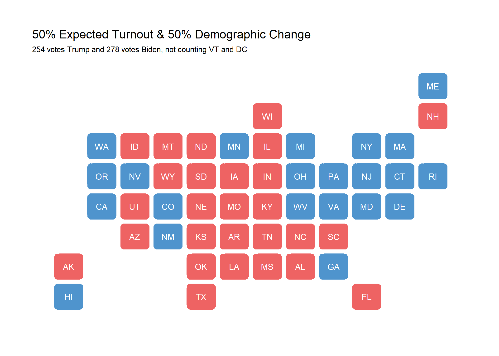
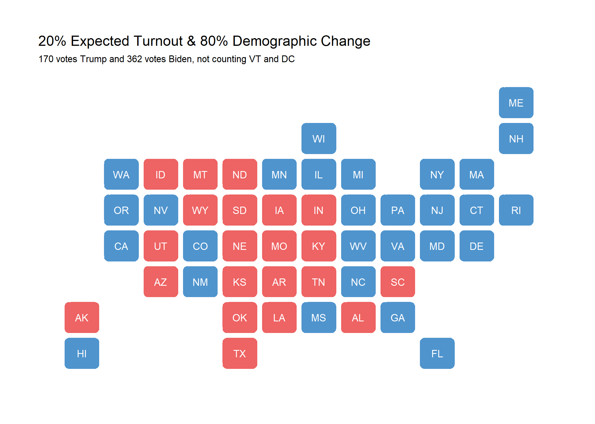
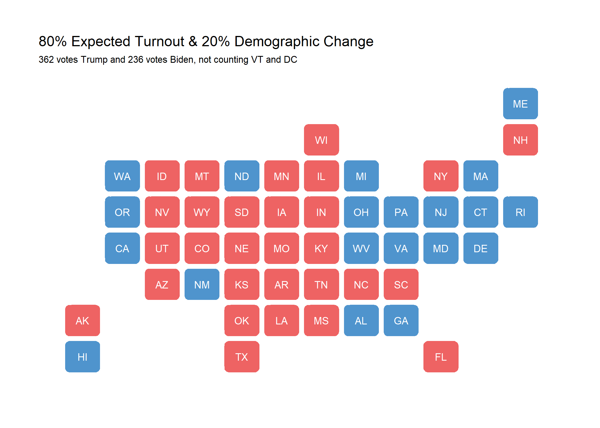

2020 is certainly an extraordinary year, and there are many new and existing factors that may contribute to the election outcome. While demographic voting blocs have always been of interest, prediction is complicated by issues in turnout and a dampened ground game due to COVID-19 restrictions. As such, this blog post will explore the ground game and demographic variables to determine which factors are most salient for the 2020 presidential election.

## The Ground Game

In the past few elections, there has been a return to individualized voter mobilization efforts, known as the ground game. The mobilization effects of the ground game are proven and significant: In 2012, voter turnout increased 7-8% from the previous year in heavily targeted states ([Enos & Fowler, 2016](https://www.cambridge.org/core/journals/political-science-research-and-methods/article/aggregate-effects-of-largescale-campaigns-on-voter-turnout/20C500B0DE62227873FD24CB3555F779/share/3d73ff531df62646698518c2717d3e1d33bcd0ef)). In fact, social scientists have even looked at the localized effects of field offices and projected that Obama's field office efforts raked in 275,000 additional voters in 2012, at a cost of $49.50 per vote when dividing the number of votes by the cost of operating said field offices ([Darr, 2014](https://journals-sagepub-com.ezp-prod1.hul.harvard.edu/doi/full/10.1177/1532673X13500520)). However, in examining the 2016 election, the relationship between field office quantity and location and popular vote share is less clear:

While Clinton had a clear advantage in sheer number, various states that her campaign concentrated on still went red: Florida, Ohio, Michigan, and Pennsylvania. We also see clear preference for both candidates to open up more offices in swing states, as solidly partisan states such as California and Texas saw few field offices.

I believe that including the ground game in this prediction is undesirable for two reasons: Firstly, there are still other factors that better explain the election in addition to field offices' locations, which don't immediately correlate with outcomes. Secondly, due to the COVID-19 pandemic, the ground game has been severely depressed. Because of differing levels of caution in regards to the risk of COVID-19 infection, the relationship between field office efforts and mobilization is further muddied. Even if certain door-to-door efforts are occuring, folks may not respond to a knock on the door in the middle of a pandemic. There are other avenues for the ground game to still be played: Through texting, phonebank campaigns, and snail mail. However, seeing as the strongest mobilization effects studied have been GOTV efforts and mobilization campaigns based out of field offices, rather than persuasion, I'd like to turn my attention to another part of the 2020 puzzle: demographic voting blocs.

## Demographics

How will demographic changes shift the election this time around? The demographic data I looked at included race, gender, and region. The variables for my demographic model look at the changes in certain populations and the effect of said changes (population increases or decreases) on vote share. These population changes include racial (Asian, Hispanic, white, Black), gender (female and male, not including other genders), age (20-35 years of age, 35-45, 45-65, and 65+), and regional (New England, Mountain, Pacific, Central, Atlantic). Running a linear model on the change in demographics and its impact on Democratic vote share, we find that an increase in Black and female voters is associated with an increase in the Democratic vote share, whereas an increase in older voters leads to a decreased Democratic vote share.

Next, I created a weighted ensemble using last week's expected Democratic 2-party vote share based off of polling and the voter eligible population and this week's predictions using demographic variables. The results can be seen in the maps below, which again exclude Vermont and D.C. due to data joins. Vermont and D.C. each have 3 electoral votes, which may sway the predicted winner depending on the prediction weightings.

As you can see, a close 50-50 split based off of expected turnout for Democrats using polling and expected vote share for Democrats using demographic changes yields the tightest election. It is hard to tell which demographic changes may actually be reflected in the vote, however. One possibility for this election is that various demographics - perhaps lower income and/or older folks - may turn out at the polls significantly less than expected. This leads me to the next part of the puzzle that I want to examine next week: expected turnout and how it can be used in conjunction with demographic changes for a more robust picture of the 2020 election.

*You can find the replication scripts for graphics included in this week's blog [here](https://github.com/caievelyn/election-analytics/blob/master/scripts/2020_10_18_script.R). You can find the necessary data [here](https://github.com/caievelyn/election-analytics/tree/master/data).*
