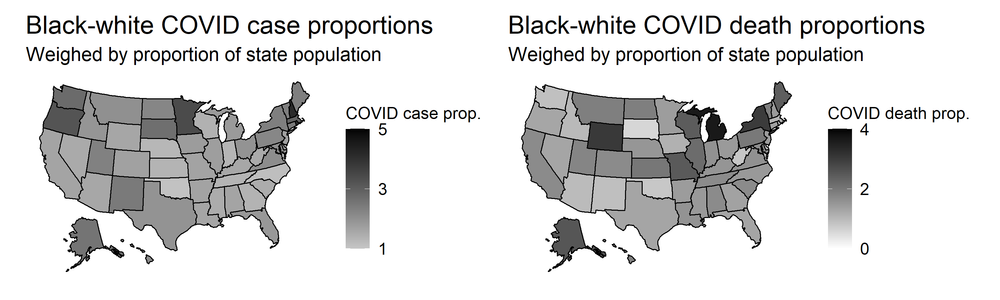

The COVID-19 pandemic is an unpredictable and shocking exogenous factor in this 2020 election. In this blog post, I will first weigh in on whether shocks truly impact election results and what the implications are for liberal democracy. Next, I will examine COVID-19 trends and examine a hypothetical situation in which COVID-19 trends impact voter choices.

## Shocks

There are two schools of thought on whether, and if so, how shocks affect election outcomes. One study contends that voters attributed shark attacks to the failure of the incumbent president, Woodrow Wilson, and that beach counties had a significantly lower Wilsonian vote share than non-beach counties ([Achen & Bartels, 2017](https://www-jstor-org.ezp-prod1.hul.harvard.edu/stable/j.ctvc7770q)). This is a rather dim outlook, as it implies that voters are unable to assess and reward political competency. Another school of thought claims that shocks, although exogenous in nature, can become incorporated into voters' election calculus when the government clearly fails at providing political help, such as disaster relief or regulating preventative measures ([Healy, 2010](https://www.researchgate.net/publication/267370660_Random_Events_Economic_Losses_and_Retrospective_Voting_Implications_for_Democratic_Competence_Research_Note)). This outlook attributes more rationality to voters, and is one that I share.

The COVID-19 pandemic allows us to explore this idea further; the relationship between COVID-19 deaths per capita compared to the average and approval ratings for President Trump is strongly negative ([The Washington Post, 2020](https://www-washingtonpost-com.ezp-prod1.hul.harvard.edu/politics/2020/03/20/americans-have-increasingly-dismal-views-economy-they-dont-blame-trump/ics/2020/03/20/americans-have-increasingly-dismal-views-economy-they-dont-blame-trump/)). Indeed, presidential job approval ratings are historically associated with re-election chances, so this finding has important implications for our election prediction ([Gallup, 2020](https://news.gallup.com/poll/311825/presidential-job-approval-related-reelection-historically.aspx)).

Although COVID-19 is an exogenous shock and an initially apolitical one, the nature of its origin in China, the administration's sluggish and patchwork response, and the continued politicization and polarization of COVID-19 prevention tactics such as mask-wearing have rendered COVID-19 an inherently political issue. Arguably, under a different administration, the rhetoric may have been less offensively xenophobic, the shutdowns more swift, and the discourse around mask-wearing less controversial. If one can imagine a different set of outcomes through this thought experiment of changing a political factor, then that means the issue of COVID-19 is indeed political. Voters' disapproval of President Trump does not reflect their myopic dissatisfaction, but rather real political punishment for the Trump administration's relatively poor handling of the virus. While it is difficult to empirically test how the election outcome may change, as we have never encountered COVID-19 before the current election cycle, it is pretty plain to see that COVID-19 will have *some* impact on election outcomes. Below, I engage in another thought experiment by examining a hypothetical situation in which communities of color particularly hurt by COVID-19 are galvanized to vote for Biden over Trump.

## Hypothetical Scenario: COVID-19 and the Black vote

The virus has ravaged certain communities of color disproportionate to the non-Hispanic white community ([Centers for Disease Control and Prevention, 2020](https://www.cdc.gov/coronavirus/2019-ncov/covid-data/investigations-discovery/hospitalization-death-by-race-ethnicity.html)). Case rights are 2.6x higher for the Black community, 2.8x higher for the Latinx and indigenous communities, and 1.1x higher for Asian Americans. Hospitalization rates are almost 5x higher for the Black, Latinx, and indigenous communities, whereas death rates are approximately double for the Black community and 1.4x higher for the indigenous community. 

Below is a map that illustrates how disproportionately hard the Black population was hit compared to the white population in a given state. Darker colors correspond to a more drastic racial imbalance. The value was calculated by examining the proportion of Black cases and deaths out of all COVID-19 cases and deaths, and comparing to the proportion of Black residents in a given state.

Last week's model featured a weighted ensemble of two models, the first of which combined the propensity to vote based off a binomial logit model of a state's voter eligible population and public opinion polls. The second model examined demographic changes' impact on vote. For this week, I will build off of this weighted ensemble examining various hypothetical situations. They are as follows:

1. The effect of Black voters increases by 1.12 times in general.
2. The effect of Black voters increases by 1.12 times only in states with a disproportionate COVID-19 effect on Black communities.
3. The effect of Black voters increases by a rate proportional to the rate at which the Black population was (over) affected by COVID-19 relative to the white population.

I derived the 1.12x effect by approximating an increase in Black turnout by comparing the Black voter turnout in 2012 to 2016. In 2016, there was a 7-point decline from 66.9% to 59.9% of Black folks who voted ([Pew Research Center, 2017](https://www.pewresearch.org/fact-tank/2017/05/12/black-voter-turnout-fell-in-2016-even-as-a-record-number-of-americans-cast-ballots/)). I define a "disproportionate COVID-19 effect" as a rate over 1. Below, find the outcome maps for each scenario at a weighting of 50-50 for each component of the weighted ensemble: 

Note that models 1 and 2 result in the same outcome map, despite six states having different predicted vote shares because the rate of Black deaths was the same or less than the rate of white deaths. These states include Arizona, Idaho, New Mexico, Oklahoma, South Dakota, Washington, and West Virginia, whose partisan lean was unchanged by the lack of a Black voter surge. Model 3 is exceedingly optimistic for Biden, although it must be noted that weighting by the exact ratio of black to white COVID deaths yields impossible vote share predictions, such as 236% of the vote share for Biden in Alabama.

The key assumptions I made today were as follows:
1. COVID-19 deaths are the most accurate metric for determining what will galvanize Black voters to turn out at the polls.
2. Using COVID-19 death ratios by race linearly were most appropriate (this is likely untrue given the wild estimates in Model 3).
3. COVID-19 deaths and the interaction with the Black community is the most salient relationship (this is almost definitely untrue given that other communities have also been impacted at disproportionate rates).
4. A 50-50 weighted ensemble is most appropriate (not necessarily true).
5. In models 1 and 2, the effect of Black voters is 1.12x (this number is quite arbitrary).

To attack and test out the strength of my prediction, I will be varying these assumptions in the coming week. This hypothetical situation demonstrates that 1) Black communities have been disproportionately impacted in death rates in most states and 2) If Black voters who personally experienced the losses of loved ones due to COVID-19 attributed it to the incumbent president, then "the effect" of increased turnout will exceedingly lean blue. However, there are many other interesting interactions, such as with state partisan lean, local economic factors, and geographic disaggregation of COVID-19 deaths, that beg to be explored in the future.

*You can find the replication scripts for graphics included in this week's blog [here](https://github.com/caievelyn/election-analytics/blob/master/scripts/2020_10_25_script.R). You can find the necessary data [here](https://github.com/caievelyn/election-analytics/tree/master/data).*
