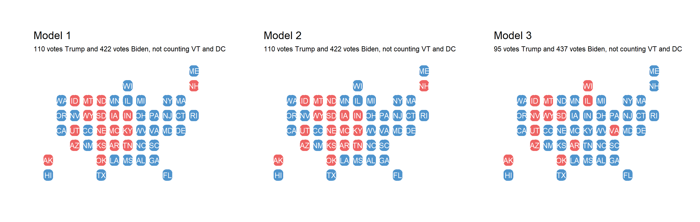

As November 3rd is less than two days away, in this blog post I create a final prediction for the 2020 U.S. presidential election based off of state winners.

(1) model formula (or procedure for obtaining prediction), 
(2) model description and justification, 
(3) coefficients (if using regression) and/or weights (if using ensemble), 
(4) interpretation of coefficients and/or justification of weights, 
(5) model validation (recommended to include both in-sample and out-of-sample performance unless it is impossible due to the characteristics of model and related data availability), 
(6) uncertainty around prediction (e.g. predictive interval)
(7) graphic(s) showing your prediction

## The Model

## Validation and Uncertainty

*You can find the replication scripts for graphics included in this week's blog [here](https://github.com/caievelyn/election-analytics/blob/master/scripts/2020_11_01_script.R). You can find the necessary data [here](https://github.com/caievelyn/election-analytics/tree/master/data).*
