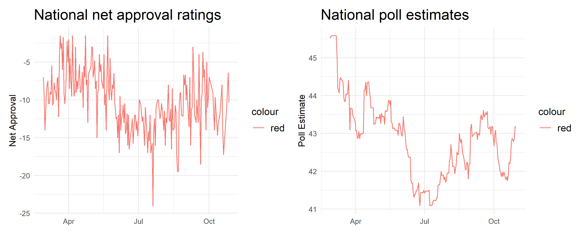
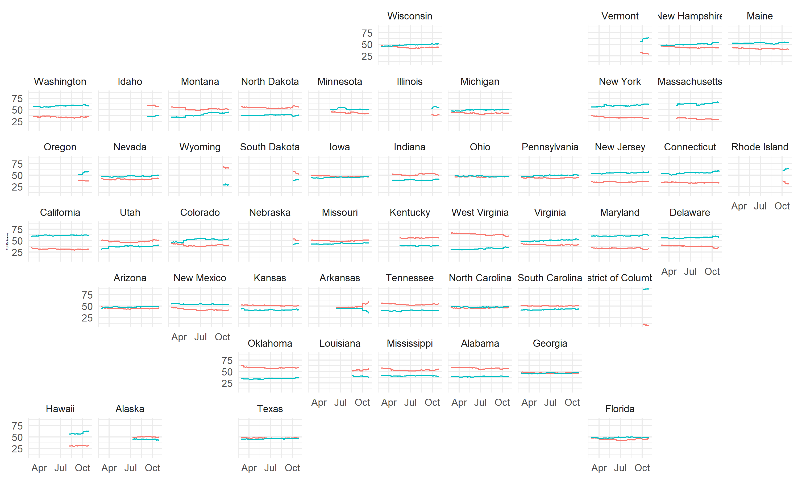
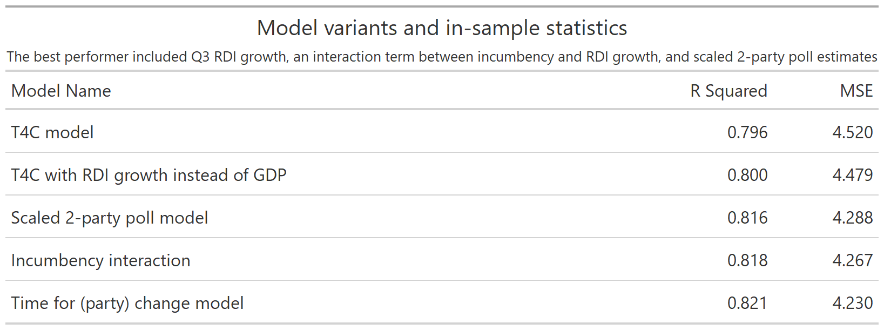
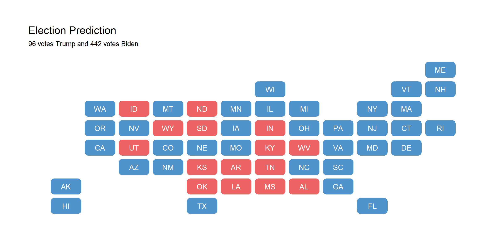
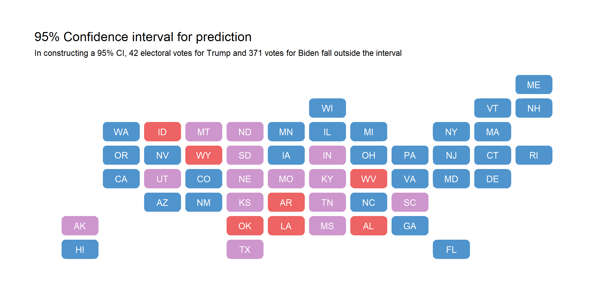

As November 3rd is less than two days away, in this blog post I create a final prediction for the 2020 U.S. presidential election based off of state winners.

A sneak peek of what's ahead:
* My model parameters include Q3 RDI growth, incumbency, party incumbency, and state-level polls scaled for 2-party estimates.
* I express that voters are rational actors that use retrospective voting as a tool to gauge political competency.
* I make a prediction for 2020. No spoilers!

## The Model

My model is based off of Abromowitz's time for change model and adapted for the state level. Abromowitz's three explanatory variables are Q2 GDP growth, national net approval ratings for the president, and incumbency. While extremely parsimonious and highly accurate, the model does not show vote choice disaggregated by state. 

One of my explanatory variables is state-level poll estimates instead of national presidential net approval ratings. The figure below shows the trends in Trump's average net approval ratings, calculated by taking the average of the difference between his approval and non-approval ratings, and nation-wide poll estimates for his share of the 2-party vote come November 3rd. As you can see, the troughs and peaks in both charts follow each other quite similarly and indicate that poll estimates and national approval ratings approximate around the same thing, which is vote choice.



Unlike national approval ratings, however, poll estimates can further be disaggregated by state. This data was downloaded from [538](https://projects.fivethirtyeight.com/2020-election-forecast/). The figure below shows how poll estimates have changed from the end of February until the most recent model date, October 30th. Disaggregating by state is important for two reasons:
1) The nature of the winner-takes-all electoral college system means we should be very tuned in to state partisan leanings rather than overall national popular vote share. Exhibit A: The 2000 and 2016 elections, in which the elected President was not the candidate with the majority popular vote share overall.
2) State partisan leanings have implications for down-ballot races as well; if Texas sees a Trump victory by 2 points, for example, down-ballot races are likely quite competitive as well given that Texas has been reliably red until 2016.



**Parameters**

Fundamental indicators are a strong predictor of elections. Firstly, voters balance sociotropic and individual-level concerns on the state of society and what that means for their immediate communities. Economic data, at least in national aggregate, is consistent and widely accessible. Voters cast their ballots based off of retrospective assessments of presidential performance, and the economy is good proxy for this retrospection process because its effects are felt immediately in terms of inflation or increased levels of real disposable income, as well as covered extensively by the media and touted by political figures as resume-building credentials. Because of the human difficulty it takes to accurately recall economic performance over a 4-year span, voters overwhelmingly tend to measure the entire 4-year economic performance based off of the last two years, especially the last two quarters of election year ([Healy & Lenz, 2013](https://onlinelibrary.wiley.com/doi/abs/10.1111/ajps.12053)).


Another piece of the puzzle is incumbency. While voters have no underlying preference for incumbents once other factors are controlled for, the reality is that their time in office confers benefits to their election ([Brown, 2014](https://www-cambridge-org.ezp-prod1.hul.harvard.edu/core/services/aop-cambridge-core/content/view/ECFE39E003912F8AF65C2AD14A34BD8C/S2052263014000062a.pdf/div-class-title-voters-don-t-care-much-about-incumbency-div.pdf)). In fact, only 3 sitting presidents- Ford, Carter, and George H.W. Bush- have lost their re-election campaigns in the post-war era. I believe the main mechanism incumbency confers advantages to candidates is through the financial aspect. Indeed, residents reward sitting presidents for spending in their area, presumably because the spending indicates future prosperity under the President ([Kriner & Reeves, 2012](https://www-cambridge-org.ezp-prod1.hul.harvard.edu/core/services/aop-cambridge-core/content/view/D7E15E901EA52BF92E5986626766224F/S0003055412000159a.pdf/div-class-title-the-influence-of-federal-spending-on-presidential-elections-div.pdf)). I hypothesize that adding an incumbency interaction term to the fundamentals variable will result in a stronger model.

While only 3 incumbent presidents have lost in the 18 post-WWII elections, 11 incumbent parties have lost. This may indicate voters' preferences for a change of pace, as described by [Abromowitz](https://pollyvote.com/en/components/models/retrospective/fundamentals-plus-models/time-for-change-model/). I also believe that this reflects the voter psyche of retrospective voting, as failures and negative events that accrue over a 4-year term may cause voters to simply get tired of the incumbent party. In examining the impact of shocks on presidential elections, it is found that voters still punish/reward incumbents for politically exogenous shocks that are endogenized through government interaction with the issue, such as natural disaster response ([Healy & Malholtra, 2010](https://ideas.repec.org/a/now/jlqjps/100.00009057.html)). Simply by being an incumbent, a candidate is held responsible for factors that may have originated exogenously. Voters may tire of incumbent party platforms for this reason.

Regarding fundamentals, I test two indicators: GDP growth and RDI growth, to determine which can be a better predictor. I avoid looking at stock movements, inflation, or unemployment, as models that regress 2-party vote share against those singular variables find weak R-squared values (respectively, they are 0.08, 0.09, and 0.02) relative to GDP and RDI growth. GDP and RDI growth are better measures than absolute GDP and RDI levels, as the latter do not tell us whether the incumbent simply inherited a booming economy or a failing one. Additionally, I test Q2 and Q3 to determine whether an average of the two periods or Q3 alone is a better indicator based off of Healy & Lenz's findings that other quarters are weak predictors.

As mentioned previously, poll estimates closely follow presidential approval ratings, which have a strong correlation with the incumbent's 2-party vote share. Therefore, I use the most recent state-level polling data there is available for 2 reasons. The first is that polls tend to converge towards the actual outcome ([Gelman & King, 1993](https://gking.harvard.edu/files/abs/variable-abs.shtml)). The second is that, given the United States's electoral college system, disaggregating by state is of utmost importance because a national popular vote win could very well fail to reflect an electoral college win.

Next, I examine the models' in- and out-of-sample predictive power and examine the coefficients on my model of choice.

**Validation**

Seeing the success of Abromowitz's parsimonious linear regression model, I tested several variants of the time for change model and gathered their in-sample R-squared fit values and out-of-sample cross-validation R-squared values. First, I chose to use Q3 economic indicators rather than indicators averaged over Q2 and Q3 because every single model formula variant performed better when using Q3 data rather than averaged Q2 and Q3 economic indicators. This was a surprising finding, as I previously believed that taking the average could protect our model performance by mitigating unusually poor or good economic performance. The formulas I used can be found below. For `mod2`, for example, the adjusted R-squared was 0.800 when solely using the Q3 RDI growth indicator (5-fold cross-validation R-squared was .795), whereas the adjusted R-squared was .788 when using averaged Q2 and Q3 RDI growth (5-fold cross-validation R-squared was .786). When performing cross-validation, the mean squared errors' standard errors were similar. For these reasons, the following models will be tested using only Q3 indicators.

```
mod1 <- formula(D_pv2p ~ avg_poll + GDP_growth_qt + incumbent)
mod2 <- formula(D_pv2p ~ avg_poll + RDI_growth + incumbent)
mod3 <- formula(D_pv2p ~ poll_2party + RDI_growth + incumbent)
mod4 <- formula(D_pv2p ~ poll_2party + RDI_growth + incumbent + RDI_growth:incumbent)
mod5 <- formula(D_pv2p ~ poll_2party + RDI_growth + incumbent + RDI_growth:incumbent + incumbent_party)
```



Indeed, when performing 5-fold cross-validation, `mod5` was the best performer with a mean squared error of 4.14 and R-squared of .834, compared to the worst performer `mod1` with 4.50 MSE and .796 R-squared. The MSE is useful because extreme values are punished more in out-of-sample model evaluations, which is especially pertinent for 2020 since it may indeed yield a more extreme prediction.

Now that I've tested my model for in-sample and out-of-sample fit, it is time to examine the coefficients.

**Coefficients**

<table style="text-align:center"><tr><td colspan="2" style="border-bottom: 1px solid black"></td></tr><tr><td style="text-align:left"></td><td>2-party Democratic vote share</td></tr>
<tr><td colspan="2" style="border-bottom: 1px solid black"></td></tr><tr><td style="text-align:left">Poll estimate (scaled for 2 parties)</td><td>0.902<sup>***</sup></td></tr>
<tr><td style="text-align:left"></td><td>(0.019)</td></tr>
<tr><td style="text-align:left">Q3 RDI growth</td><td>-2.665</td></tr>
<tr><td style="text-align:left"></td><td>(21.534)</td></tr>
<tr><td style="text-align:left">Incumbency</td><td>1.807<sup>***</sup></td></tr>
<tr><td style="text-align:left"></td><td>(0.612)</td></tr>
<tr><td style="text-align:left">Party incumbency</td><td>-1.532<sup>***</sup></td></tr>
<tr><td style="text-align:left"></td><td>(0.513)</td></tr>
<tr><td style="text-align:left">Interaction: Q3 RDI growth and incumbency</td><td>-126.799<sup>**</sup></td></tr>
<tr><td style="text-align:left"></td><td>(50.234)</td></tr>
<tr><td style="text-align:left">Constant</td><td>4.654<sup>***</sup></td></tr>
<tr><td style="text-align:left"></td><td>(0.974)</td></tr>
<tr><td colspan="2" style="border-bottom: 1px solid black"></td></tr><tr><td style="text-align:left">Observations</td><td>510</td></tr>
<tr><td style="text-align:left">Adjusted R<sup>2</sup></td><td>0.820</td></tr>
<tr><td style="text-align:left">Residual Std. Error</td><td>4.255 (df = 504)</td></tr>
<tr><td colspan="2" style="border-bottom: 1px solid black"></td></tr><tr><td style="text-align:left"><em>Note:</em></td><td style="text-align:right"><sup>*</sup>p<0.1; <sup>**</sup>p<0.05; <sup>***</sup>p<0.01</td></tr>
</table>

For every point increase in polls for the Democratic candidate, the predicted 2-party vote share increases on average because of a positive coefficient. My incumbency and party incumbency hypotheses are reflected in the positive coefficients for each of these parameters. However, the negative coefficient with a high standard error for Q3 RDI growth, and the large negative term for the interaction parameter is concerning. I add controls for state by creating dummy variables for each state, which still yields a similarly large standard error for the negative coefficient of RDI growth. I will avoid using this 54-parameter model due to overfitting concerns.

I will proceed with model 5 with an important tweak and a caveat. I acknowledge that the predictive uncertainty will be impacted by the large standard error of the interaction term. Therefore, I will create two separate models: one for core states (solidly partisan states) and one for [swing states](https://fivethirtyeight.com/features/swing-voters-and-elastic-states/). My finalized model details are below for the core state model (using `mod5`) and the swing state model (made as parsimonious as possible with dummy variables for each swing state).

```
core state model: D_pv2p ~ poll_2party + RDI_growth + incumbent + RDI_growth:incumbent + incumbent_party
swing state model: D_pv2p ~ poll_2party + state + incumbent + RDI_growth
```

<table style="text-align:center"><tr><td colspan="3" style="border-bottom: 1px solid black"></td></tr><tr><td style="text-align:center"></td><td colspan="2">2-party Democratic vote share</td></tr>
<tr><td style="text-align:left"></td><td>Core state vote share</td><td>Swing state vote share</td></tr>
<tr><td colspan="3" style="border-bottom: 1px solid black"></td></tr><tr><td style="text-align:left">Poll estimates</td><td>0.970<sup>***</sup></td><td>0.446<sup>***</sup></td></tr>
<tr><td style="text-align:left"></td><td>(0.018)</td><td>(0.050)</td></tr>
<tr><td style="text-align:left">Florida</td><td></td><td>1.149</td></tr>
<tr><td style="text-align:left"></td><td></td><td>(1.895)</td></tr>
<tr><td style="text-align:left">Georgia</td><td></td><td>2.379</td></tr>
<tr><td style="text-align:left"></td><td></td><td>(1.907)</td></tr>
<tr><td style="text-align:left">Iowa</td><td></td><td>3.597<sup>*</sup></td></tr>
<tr><td style="text-align:left"></td><td></td><td>(1.876)</td></tr>
<tr><td style="text-align:left">Michigan</td><td></td><td>4.179<sup>**</sup></td></tr>
<tr><td style="text-align:left"></td><td></td><td>(1.878)</td></tr>
<tr><td style="text-align:left">Minnesota</td><td></td><td>5.709<sup>***</sup></td></tr>
<tr><td style="text-align:left"></td><td></td><td>(1.865)</td></tr>
<tr><td style="text-align:left">Nevada</td><td></td><td>1.974</td></tr>
<tr><td style="text-align:left"></td><td></td><td>(1.944)</td></tr>
<tr><td style="text-align:left">New Hampshire</td><td></td><td>0.062</td></tr>
<tr><td style="text-align:left"></td><td></td><td>(1.949)</td></tr>
<tr><td style="text-align:left">North Carolina</td><td></td><td>0.796</td></tr>
<tr><td style="text-align:left"></td><td></td><td>(1.820)</td></tr>
<tr><td style="text-align:left">Ohio</td><td></td><td>1.965</td></tr>
<tr><td style="text-align:left"></td><td></td><td>(1.827)</td></tr>
<tr><td style="text-align:left">Pennsylvania</td><td></td><td>3.821<sup>**</sup></td></tr>
<tr><td style="text-align:left"></td><td></td><td>(1.873)</td></tr>
<tr><td style="text-align:left">Texas</td><td></td><td>-3.625<sup>*</sup></td></tr>
<tr><td style="text-align:left"></td><td></td><td>(1.904)</td></tr>
<tr><td style="text-align:left">Wisconsin</td><td></td><td>4.261<sup>**</sup></td></tr>
<tr><td style="text-align:left"></td><td></td><td>(1.965)</td></tr>
<tr><td style="text-align:left">RDI growth</td><td>21.433</td><td>-160.748<sup>***</sup></td></tr>
<tr><td style="text-align:left"></td><td>(21.948)</td><td>(36.494)</td></tr>
<tr><td style="text-align:left">Incumbency</td><td>1.617<sup>**</sup></td><td>0.731</td></tr>
<tr><td style="text-align:left"></td><td>(0.625)</td><td>(0.785)</td></tr>
<tr><td style="text-align:left">Party incumbency</td><td>-1.501<sup>***</sup></td><td></td></tr>
<tr><td style="text-align:left"></td><td>(0.520)</td><td></td></tr>
<tr><td style="text-align:left">Interaction of RDI growth and incumbency</td><td>-132.769<sup>**</sup></td><td></td></tr>
<tr><td style="text-align:left"></td><td>(51.994)</td><td></td></tr>
<tr><td style="text-align:left">Constant</td><td>1.401</td><td>24.847<sup>***</sup></td></tr>
<tr><td style="text-align:left"></td><td>(0.928)</td><td>(2.653)</td></tr>
<tr><td colspan="3" style="border-bottom: 1px solid black"></td></tr><tr><td style="text-align:left">Observations</td><td>375</td><td>135</td></tr>
<tr><td style="text-align:left">R<sup>2</sup></td><td>0.887</td><td>0.633</td></tr>
<tr><td style="text-align:left">Adjusted R<sup>2</sup></td><td>0.886</td><td>0.587</td></tr>
<tr><td style="text-align:left">Residual Std. Error</td><td>3.730 (df = 369)</td><td>4.116 (df = 119)</td></tr>
<tr><td colspan="3" style="border-bottom: 1px solid black"></td></tr><tr><td style="text-align:left"><em>Note:</em></td><td colspan="2" style="text-align:right"><sup>*</sup>p<0.1; <sup>**</sup>p<0.05; <sup>***</sup>p<0.01</td></tr>
</table>

Let's talk core states first. For every point increase in polls for the Democratic candidate, the predicted 2-party vote share increases by 0.97 points on average. As expected, incumbency also provides a boost; all else held equal, an incumbent has a 1.62 point advantage over their opponent on average. Again confirming my hypothesis, party incumbency is a disadvantage; all else held equal, a candidate whose party was previously in power sees a 1.5 point disadvantage on average. While the RDI growth error is still large, the coefficient makes substantive sense as it is positive; for every 1% increase in Q3 RDI growth, there is on average a 20-point increase in vote share (again caveating with the large standard error). The average residual standard error is 3.73 for this model, which is an improvement from the previous unseparated model.

Looking at the swing state model, it is evident that this model has less predictive power due to its lower R-squared and higher residual standard error. Relative to the unseparated model, however, the average error magnitude is still lower. Note that the constant is 24 versus the constant in the core states model, which is 1. Even though the state dummy variables' coefficients are positive, it does not necessarily mean that each swing state leans Democratic; rather, we can only draw comparisons about their relative partisan leanings. 

Next, I will apply these models to a 2020 prediction.

## The Prediction

I obtained updated state-level polling data from [538](https://projects.fivethirtyeight.com/2020-election-forecast/). I also obtained updated Q3 economic data from the [Bureau of Economic Analysis](https://www.bea.gov/news/2020/gross-domestic-product-third-quarter-2020-advance-estimate). The final point predictions are shown below in a map; it is highly optimistic for Biden, at 442 electoral votes, versus Trump's 96.



I think that this is not unlikely, albeit unprecedented. The Trump administration has handled the coronavirus pandemic markedly poorer compared to other countries. The death toll is continuously rising, and his rhetorical style is increasingly divisive even among Republicans ([CNN](https://www.cnn.com/2020/10/20/politics/republican-senate-reaction-trump/index.html)).

That being said, point estimates are not as helpful as viewing the entire predictive interval. We have the standard error of each out-of-sample prediction, so I constructed a 95% confidence interval by taking the point prediction and adding/subtracting `1.96 * stderr`. The confidence intervals do not tell us that we can expect Biden or Trump to win with 95% probability; rather, it merely describes that a projected 95% of the time, the Democratic vote share will fall within a certain range. I mapped out the values that fell outside of this 95% confidence interval below. If the lower bound was above 50% vote share, the state is colored blue; if the upper bound was below 50% vote share, the state is colored red. States that cover 50% vote share within the 95% confidence interval are colored purple. Note that D.C. was not included due to dropping from data joins.




*You can find the replication scripts for graphics included in this week's blog [here](https://github.com/caievelyn/election-analytics/blob/master/scripts/2020_11_01_script.R). You can find the necessary data [here](https://github.com/caievelyn/election-analytics/tree/master/data).*
