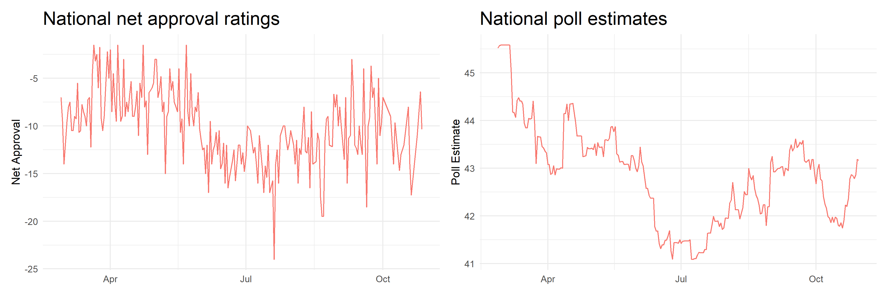

As November 3rd is less than two days away, in this blog post I create a final prediction for the 2020 U.S. presidential election based off of state winners.

(1) model formula (or procedure for obtaining prediction), 
(2) model description and justification, 
(3) coefficients (if using regression) and/or weights (if using ensemble), 
(4) interpretation of coefficients and/or justification of weights, 
(5) model validation (recommended to include both in-sample and out-of-sample performance unless it is impossible due to the characteristics of model and related data availability), 
(6) uncertainty around prediction (e.g. predictive interval)
(7) graphic(s) showing your prediction

## The Model

My model is loosely based off of Abromowitz's time for change model and adapted for the state level. Abromowitz's three explanatory variables are Q2 GDP growth, national net approval ratings for the president, and incumbency. While extremely parsimonious and highly accurate, the model does not show vote choice disaggregated by state. 

One of my explanatory variables is state-level poll estimates instead of national presidential net approval ratings. The figure below shows the trends in Trump's average net approval ratings, calculated by taking the average of the difference between his approval and non-approval ratings, and nation-wide poll estimates for his share of the 2-party vote come November 3rd. As you can see, the troughs and peaks in both charts follow each other quite similarly and indicate that poll estimates and national approval ratings approximate around the same thing, which is vote choice.

Unlike national approval ratings, however, poll estimates can further be disaggregated by state. This data was downloaded from [538](https://projects.fivethirtyeight.com/2020-election-forecast/). The figure below shows how poll estimates have changed from the end of February until the most recent model date, October 30th. Disaggregating by state is important for two reasons:
1) The nature of the winner-takes-all electoral college system means we should be very tuned in to state partisan leanings rather than overall national popular vote share. Exhibit A: The 2000 and 2016 elections, in which the elected President was not the candidate with the majority popular vote share overall.
2) State partisan leanings have implications for down-ballot races as well; if Texas sees a Trump victory by 2 points, for example, down-ballot races are likely quite competitive as well given that Texas has been reliably red until 2016.

## Validation and Uncertainty

*You can find the replication scripts for graphics included in this week's blog [here](https://github.com/caievelyn/election-analytics/blob/master/scripts/2020_11_01_script.R). You can find the necessary data [here](https://github.com/caievelyn/election-analytics/tree/master/data).*
