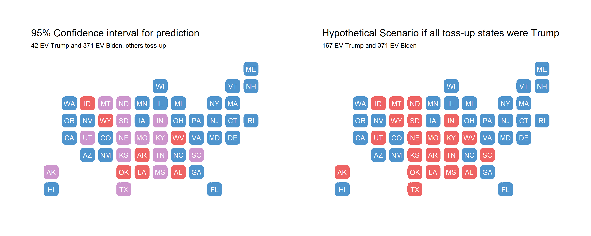

## Model recap

My prediction model for the 2020 presidential election was based off of the time for change model, with 4 key changes: 1) It predicted state-level 2-party vote share rather than national 2-party vote share and separated core states from swing states; 2) It used Q3 RDI growth rather than Q2 GDP growth; 3) It included an interaction term between incumbency and RDI growth for swing states, and 4) It included a "time for party change" variable.

As a refresher, my point estimate for Biden's electoral college vote count was 442, versus Trump's 96. Notably, this was quite optimistic. Although I would've loved to be right with this bold prediction, there are a number of factors I want to explore today that could have affected my model's predictive power. Firstly, I'd like examine any systematic patterns in my predictions in order to form hypotheses on how to fix them.

As noted above, the least difference between predicted and actual outcome was for the state of Illinois, for which the model over-predicted Biden by 2.63 points. In terms of states that were wildly off, the top is New York at a 13.8 point difference (although not all votes are in yet). Disregarding New York for a second, the next most erroneous states include solid red states, such as North Dakota, Iowa, and West Virginia. Notably, core blue states such as Massachusetts and California were less erroneous, ranking in the top half of accuracy. This systematic severe under-prediction for Trump's vote share in core red states shows that my model failed to capture the tendency of Republican voters to vote as we'd expect them to based off of historical voting patterns. Indeed, it seems like the media narrative of core red states becoming tossup states is preliminarily disproved, as many of these core states went the way we'd have expected them to go based off of prior voting records.

Also notably, *not a single state* saw an over-prediction for Trump's vote share. Ultimately, I got 40 states right (1 more including D.C.) and 10 wrong - of these 10, all of them went to Trump rather than Biden. These 10 states are also traditionally red states, and the predicted point estimate hovered around 50%. Below, find 

In my prediction blog post, I displayed a map with "safe" red states, "safe" blue states, and tossup states. Tossup states were defined as those where the 95% confidence interval crossed the 50% vote share threshold to win. As a thought experiment, below I explore if all toss-up states went to Trump instead.

There is still a systematic underprediction for Biden; specifically, I am missing North Carolina, Florida, and Ohio. It seems like my model generally did well at predicting the battleground states that were Arizona, Nevada, Georgia, Pennsylvania, Michigan, and Wisconsin in terms of outcome. However, the average RMSE overall was quite large at **8.16**. Below, I explore some reasons why my model accuracy was off and test those hypotheses.

## Increasing predictive power

## If I had a redo

*You can find the replication scripts for graphics included in this week's blog [here](https://github.com/caievelyn/election-analytics/blob/master/scripts/2020_11_23_script.R). You can find the necessary data [here](https://github.com/caievelyn/election-analytics/tree/master/data).*
