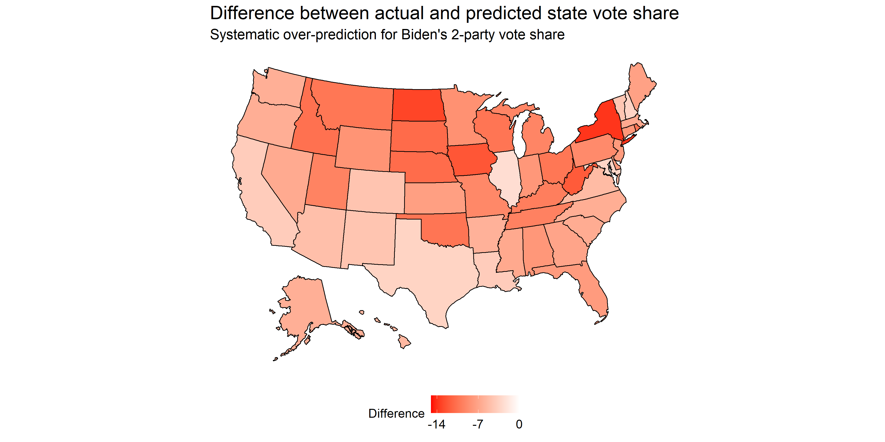
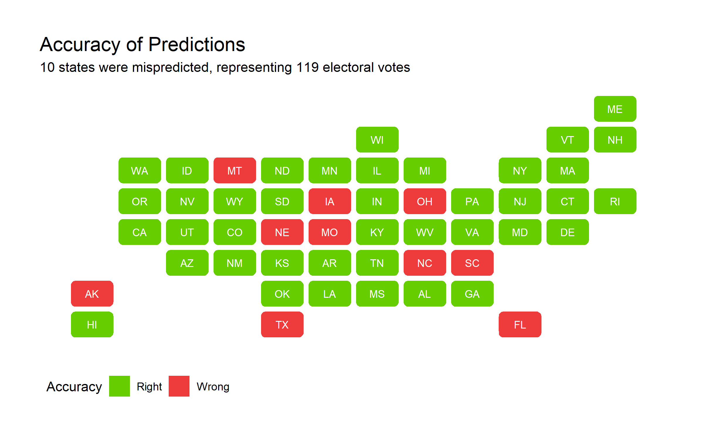

## Model recap

My prediction model for the 2020 presidential election was based off of the time for change model, with 4 key changes: 1) It predicted state-level 2-party vote share rather than national 2-party vote share and separated core states from swing states; 2) It used Q3 RDI growth rather than Q2 GDP growth; 3) It included an interaction term between incumbency and RDI growth for swing states, and 4) It included a "time for party change" variable.

As a refresher, my point estimate for Biden's electoral college vote count was 442, versus Trump's 96. Notably, this was quite optimistic. Although I would've loved to be right with this bold prediction, there are a number of factors I want to explore today that could have affected my model's predictive power. Firstly, I'd like examine any systematic patterns in my predictions in order to form hypotheses on how to fix them.

As noted above, the least difference between predicted and actual outcome was for the state of Illinois, for which the model over-predicted Biden by 2.63 points. In terms of states that were wildly off, the top is New York at a 13.8 point difference (although not all votes are in yet). Disregarding New York for a second, the next most erroneous states include solid red states, such as North Dakota, Iowa, and West Virginia. Notably, core blue states such as Massachusetts and California were less erroneous, ranking in the top half of accuracy. This systematic severe under-prediction for Trump's vote share in core red states shows that my model failed to capture the tendency of Republican voters to vote as we'd expect them to based off of historical voting patterns. Indeed, it seems like the media narrative of core red states becoming tossup states is preliminarily disproved, as many of these core states went the way we'd have expected them to go based off of prior voting records.

Also notably, *not a single state* saw an over-prediction for Trump's vote share. Ultimately, I got 40 states right (1 more including D.C.) and 10 wrong - of these 10, all of them went to Trump rather than Biden. These 10 states are also traditionally red states, and the predicted point estimate hovered around 50%. Below, find 

In my prediction blog post, I displayed a map with "safe" red states, "safe" blue states, and tossup states. Tossup states were defined as those where the 95% confidence interval crossed the 50% vote share threshold to win. As a thought experiment, below I explore if all toss-up states went to Trump instead.

left_join(popvote_2020_df, by = "state") %>%
  filter(year == 2020) %>%
  mutate(D_pv2p = 100 * D_pv2p,
         diff = D_pv2p - pred.fit,
         sq_diff = diff^2,
         sqRMSE = sum(sq_diff) / 50,
         RMSE = sqrt(sqRMSE)) %>%
  mutate(acc = case_when(pred.fit > 50 & D_pv2p < 50 ~ "Wrong",
                         TRUE ~ "Right")) %>% View()
There is still a systematic underprediction for Biden; specifically, I am missing North Carolina, Florida, and Ohio. It seems like my model generally did well at predicting the battleground states that were Arizona, Nevada, Georgia, Pennsylvania, Michigan, and Wisconsin in terms of outcome. However, the average RMSE overall was quite large at **8.16**. Since I split my predictios into core and swing states, the separate RMSE values are **7.06** and **4.10** respectively; the core state model performed relatively worse than the swing state model. Below, I explore some reasons why my model accuracy was off and test those hypotheses.

## Increasing predictive power

To explain the systematic overprediction of Biden's vote share, I hypothesize that 1) Taking the most recent state polls rather than averaging polls for the last month or so leading up to the election allowed for individual polls to exert more influence on the final prediction, 2) The interaction term between incumbency and RDI growth overly and negatively punished Trump in all core states, especially core red states, and 3) Incumbent party status may have actually mattered in swing states moreso than in core states, whereas in my model I excluded incumbent party status in swing states. Below, I test these hypotheses and provide additional justification as to why they might or might not be true.

I realized that I did not calculate poll averages correctly in my predictions; instead of filtering for the candidate first, I filtered for the candidate last. This could change the prediction greatly, so to test the effect of this mistake as well as the new hypothesis, I will first look at predictions after correcting for the mistake. Next, I will take the average of all polls in October-November 2020 rather than just the most recent polls to reduce bias from any one poll.

My predictions become outlandish after correct for this mistake with cleaning the 2020 polling data: some states' 2-party vote share exceeds 100%. Next, I turn to averaging poll estimates and making predictions based off of these averages. With this change, the RMSE is **4.84501** for my core states' model and **3.539576** for my swing states' model, which is a significant improvements. Of the 38 core states, **every single one was correctly predicted by this simple tweak**. Originally, of the 38 core states, 5 were predicted incorrectly - Alaska, Missori, Montana, Nebraska, and South Carolina. Out of the swing states, I predict Iowa, Florida, North Carolina, and Ohio incorrectly. The decrease in RMSE for both models indicate that how I was dealing with polls certainly contributed to my model inaccuracy.

Knowing that the 2020 economic indicators are all over the place given the coronavirus-induced recession, I was immediately wary of the large and negative coefficient on the interaction term. Removing this interaction term from the core states model, I now have an RMSE of **3.109244**, a further improvement. Due to the peculiarity of this year's economic trends, as well as the xenophobic scapegoating of blame to China and Democratic politicans, the Trump campaign fared better than I would've thought based off of recent economic performance.

Lastly, I test removing the incumbency party term from the core model and adding it to the swing states' model. It did not improve the root mean squared error of the core states' model, although all states were correctly predicted. However, adding `incumbeny party` to the swing states' model reduced the RMSE to **1.446285** and only 2 states were incorrectly predicted: Ohio and Iowa, both of which were about 5 points off.

While I tested these hypotheses with RMSEs, I would be careful about overfitting when making prediction models for the future. An additional hypothesis I'd like to test is my model's general inaccuracy when it comes to the Midwest. I hypothesize that indicators of economic health may not reflect Midwesterners' propensity to punish/reward the incumbent. I'd like to dive more specifically into certain industries in the Midwest, such as agriculture and mining, and look at how those industries have performed under Trump and historically to determine whether the aggregated economic indicators are not capturing the full picture for Midwestern voters.

## If I had a redo...

... I would:
* Use aggregated poll estimates over the month leading up to the election rather than latest polls to reduce bias
* Add an incumbency party term to the swing states' model
* Remove the incumbency * RDI growth interaction term and research for more disaggregated measures of economic health to predict for the Midwest

If those changes were made, here's what my 2020 map would look like:

I would miss Ohio and Iowa but correctly hit AZ, NV, FL, GA, TX, OH, PA, NC, WI, and MI.

Although it is tempting to take this new model and run, I must caution against overfitting to the 2020 election. This was undoubtedly an odd year and an odd election.

*You can find the replication scripts for graphics included in this week's blog [here](https://github.com/caievelyn/election-analytics/blob/master/scripts/2020_11_23_script.R). You can find the necessary data [here](https://github.com/caievelyn/election-analytics/tree/master/data).*
