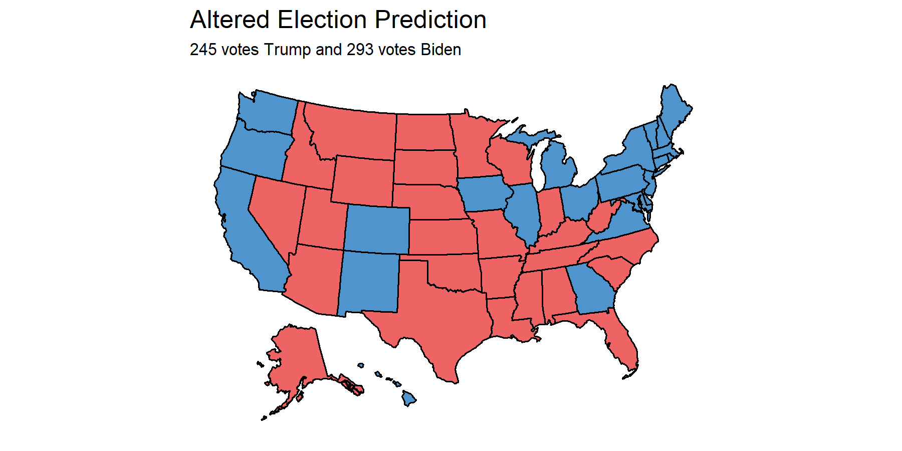

## Campaign Tactics

According to [Vavreck (20xx)](url), incumbents in office during economically prosperous times should play a "clarifying" role in linking their administration to economic health. Meanwhile, challengers in economically prosperous times should target other issues in an "insurgency" campaign in order to demonstrate the change that they'd be able to bring. 2020 is an interesting year, as the market was bullish leading up to March, and then coronavirus-induced shutdowns and layoffs led to a poorly performing economy that may be headed for even worse in the coming weeks ([Robinhood](https://learn.robinhood.com/articles/3i6hIwhY75uWjZUZiLFTFT/what-are-bull-and-bear-markets/)).

Therefore, we would expect for Joe Biden to lead an insurgency campaign prior to March 12th, 2020 (the day the US stock market suffered from the greatest single-day fall since 1987), and a clarifying campaign post-March to solidify the relationship between Trump and his handling of the coronavirus pandemic. Meanwhile, we'd expect the opposite campaign tactic from Trump.

In order to test whether either candidate behaved as expected, I will evaluate 

## Increasing predictive power

## If I had a redo...

*You can find the replication scripts for graphics included in this week's blog [here](https://github.com/caievelyn/election-analytics/blob/master/scripts/2020_11_30_script.R). You can find the necessary data [here](https://github.com/caievelyn/election-analytics/tree/master/data).*
