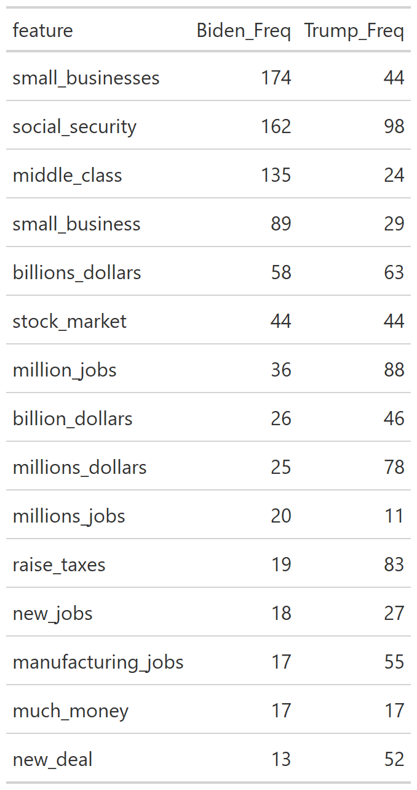
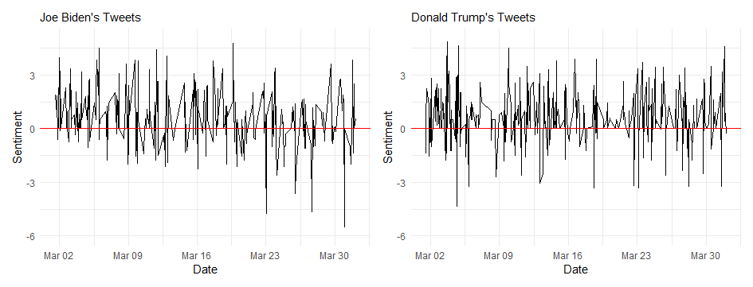

## Campaign Tactics

According to [Vavreck (2009)](https://www-jstor-org.ezp-prod1.hul.harvard.edu/stable/j.ctt7t1g4), incumbents in office during economically prosperous times should play a "clarifying" role in linking their administration to economic health. Meanwhile, challengers in economically prosperous times should target other issues in an "insurgency" campaign in order to demonstrate the change that they'd be able to bring. 2020 is an interesting year, as the market was bullish leading up to March, and then coronavirus-induced shutdowns and layoffs led to a poorly performing economy that may be headed for even worse in the coming weeks ([Robinhood](https://learn.robinhood.com/articles/3i6hIwhY75uWjZUZiLFTFT/what-are-bull-and-bear-markets/)).

Therefore, we would expect for Joe Biden to lead an insurgency campaign prior to March 12th, 2020 (the day the US stock market suffered from the greatest single-day fall since 1987), and a clarifying campaign post-March to solidify the relationship between Trump and his handling of the coronavirus pandemic. Meanwhile, we'd expect the opposite campaign tactic from Trump.

In order to test whether either candidate behaved as expected, I use text analysis to look at the frequency of various phrases that each candidate includes in their campaign speeches over time. I separate these into pre- and post- COVID, not in terms of the disease's frequency, but in terms of the economic ramifications felt throughout the country. I chose April 1st as the cutoff point between pre- and post- COVID shutdown, assuming that there is lag time between imposing restrictions and the loss of jobs. Below are two keyness plots comparing the difference in each candidate's rhetoric before and after the cutoff point. I refer to the cutoff point and "pandemic" interchangeably in this blog post for ease of reference.

Notably, Trump's decreased usage of the phrase "unemployment rate" follows what we'd expect from Vavreck's theory. However, he still mentions "greatest economy" more than before the pandemic. Despite using "raise taxes" in an anti-Biden context, that still diverges from what we'd see from an incumbent candidate who is following an insurgency campaign and wants to distance themselves from the economy as much as possible. In fact, many of the potential topics that Trump's insurgency campaign could have focused on were not mentioned as much after the pandemic, including "criminal justice", "ice officers", "drug problem", and "inclusive society". 

Meanwhile, Biden's mentions of previous Democratic presidential candidates dropped significantly, which is unsurprising since the other candidates withdrew from the race in spring 2020. Biden does seem to be leading a clarifying campaign based off of his economic references to "small businesses", and the "economic crisis".

What about the coronavirus pandemic - could this be an insurgent issue, or a clarifying one? I argue that, given the deep entanglement between the handling of the coronavirus and economic conditions, the pandemic is more of a clarifying issue. According to Vavreck's theory, one would expect that Biden would lead a clarifying campaign tying the coronavirus to Trump. Indeed, Biden made more references to "affordable care", "essential workers", "wearing masks", pre-existing conditions", and "middle [of a] pandemic" than before the negative economic consequences of the coronavirus were felt.

In the above table, note the frequencies of certain phrases after the April 1st cutoff point. Trump mentions manufacturing jobs, new jobs, "million jobs", "millions" and "billions" of dollars, and the stock market more than Biden. This isn't to say that Biden doesn't mention the economy, however: he focuses on the middle class, small businesses, and social security. 

In conclusion, Biden followed expectations in running a clarifying campaign after the economic ramifications of the pandemic started to hit Americans in April. Meanwhile, Trump defied expectations by failing to run an insurgent campaign and continuing to bring up the economy despite its tanking during his presidency.

## Sentiment Analysis

Over the month of March, as it became apparent that the coronavirus would impact Americans more than previously thought, Joe Biden's tweets trended more and more negative. Here is one of his tweets from the end of March:

> "Much has been made of changes in President Trump's tone in recent days. But with our health care system at risk, a virus spreading, our economy on the brink — and so many lives at stake — it’s time to be less interested in his words and more focused on his actions — or inaction."

Meanwhile, Donald Trump denied any long-lasting impacts:

> "“With the Tax Cuts and new Trade Deals, we were set for a tremendous growth rate this year.... and then the Virus came along.” @larry_kudlow  @MariaBartiromo We were breaking all records, especially on employment. It will all come roaring back again, and fast!"

His sentiment did not trend noticeably towards one direction, but it did stay more positive than Biden's tweets.

*You can find the replication scripts for graphics included in this week's blog [here](https://github.com/caievelyn/election-analytics/blob/master/scripts/2020_11_30_script.R). You can find the necessary data [here](https://github.com/caievelyn/election-analytics/tree/master/data).*
