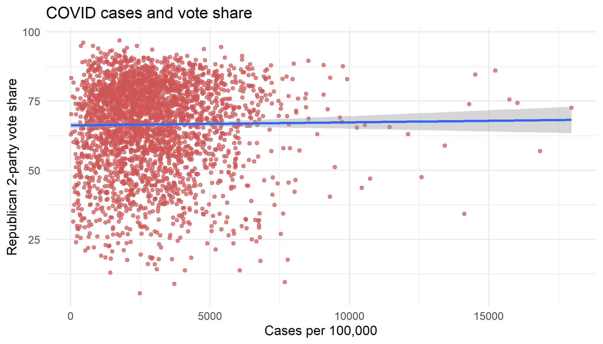

## Narrative overview

>Trump won the majority of votes in more than 90% of the 376 US counties with the highest number of new COVID-19 cases per capita. - [Business Insider](https://www.businessinsider.com/counties-with-worst-covid-19-surges-overwhelmingly-voted-for-trump-2020-11)

>The regions of the country that Trump carried have also been those most plagued by COVID-19 since late August. - [Time Magazine](https://time.com/5910256/covid-19-presidential-election-outcome/)

>...[In] places where the virus is most rampant now, Trump enjoyed enormous support. - [AP News](https://apnews.com/article/counties-worst-virus-surges-voted-trump-d671a483534024b5486715da6edb6ebf)

A dominant media narrative is that, contrary to what one may think given rational and competent restrospective voting, Donald Trump actually enjoyed an advantage over Joe Biden when it came to COVID-19. Specifically, Trump won more counties with the highest number of COVID-19 cases per capita than Biden did. 

This is not necessarily surprising once you take into account that mask-wearing and prevention of the coronavirus's spread is a polarized and partisan issue. Given Trump's track record of [refusing to wear masks](https://www.nytimes.com/2020/10/02/us/politics/donald-trump-masks.html) or denounce those who fail to abide by social distancing rules, one would expect that red-leaning counties may be faring worse than their blue-leaning counterparts.

What may be interesting is if this effect remains true once partisanship is accounted for. For example, after controlling for which way each county went in 2016, is there still a relationship between COVID-19 cases per capita and Trump vote share? This would be a shocking finding, as it not only provides evidence for the media narrative (although we cannot say it "proves" or "concludes" anything), but suggests that voters may be incompetent at punishing politicians for mishandling natural crises. It would certainly draw concern for the efficacy of our democratic processes.

In this blog post, I am interested in expanding upon our knowledge of how the pandemic impacted voting. First, I will verify the AP's claim and control for existing partisanship by using a variable that represents Trump's vote share by county in 2016. Next, I will examine other quantities of interest besides cases per capita, including raw case numbers and death rates.

## Testing the AP Claim

The AP claims that, of the 376 counties with the highest number of new COVID-19 cases per capita as of early November, 90%+ broke for Trump. I verify this claim by using the [NYT county-level COVID-19 data](https://github.com/nytimes/covid-19-data), the county-level vote share for 2020, and the [US Census Bureau's 2019 population estimates](https://www2.census.gov/programs-surveys/popest/datasets/2010-2019/counties/totals/) by county. I join the datasets on FIPS code and county name. Then, I calculate the new case rate per capita by taking the day-to-day difference, dividing by the population, and multiplying by 100,000. Lastly, I took the top 376 counties by cases per capita as of 11/3/20 and calculated the proportion that broke for Trump vs Biden. The result: **82%** of these counties broke for Trump, which is lower than the claim but within reason. Discrepancies in how cases per capita are counted may account for the difference.

## Controlling for partisanship

Next, I create a new variable to account for Trump's 2016 vote share by county using data from the [MIT Election Lab](https://electionlab.mit.edu/data). While one year's vote shares imperfectly capture the partisanship of a county, this will at least control some of imbalance in the data generated by pre-existing preferences for one party over the other. Below, I show the coefficients of the two models, one regressing Trump 2-party vote share on cases per capita, and the other with the county's 2016 2-party vote share for Trump. 

The coefficients on cases per capita are positive, which is surprising given that partisanship was partially controlled for using 2016 vote shares as a proxy. We can interpret the model output as such: for every additional 1 case per 100,000, Trump's 2-party vote share by county increases .0001%, which is a very small coefficient value and has a p-value of .48 (not significant). The scatterplot below shows a relatively flat correlation.

## Changing the Quantity of Interest

Thus far, we have been examining cases per capita. However, I would like to examine whether other covariates may have the same positive coefficient. One reason cases per capita may not be as reliable is because of how the virus works: it spreads person to person. Different geographies may pose different risks of interpersonal contact, not to mention that one additional person with COVID-19 in New York City does not change the per capita rate by much, whereas one additional infected resident in Victoria, Texas changes the rate by quite a bit.

We would expect the coefficient on raw case numbers to be negative, since more populated cities are likelier to have higher case numbers given their population distribution, and urban areas are generally Democratic. Interestingly, when including 2016 Trump vote share, the coefficient on raw case numbers remains negative, albeit small (**-.000014** with a standard error of .000005). 

Next, I examine death rates per capita using the following formula: `r_2pv ~ deathspercapita` (pictured below). The coefficient on deaths per capita is negative and statistically significant at **-0.034**, meaning that for every additional death per 100,000, Trump's vote share is expected to see a decrease of .034%. When including the variable for 2016 Trump vote share, the coefficient on deaths per capita is positive at **.0003**, however it is statistically insignificant, likely due to differences in county size. I suspect that this result is due to the large number of rural counties compared to the number urban counties, of which the former are red-leaning.

~

## Conclusion

The media claim is true in that the counties with most COVID-19 cases per capita as of 11/3/20 broke for Trump. However, after controlling for partisan effects by using Trump's 2016 2-party vote share as a proxy, the effect of cases per capita seems insignificant. Furthermore, more deaths per capita were associated significantly with a lower vote-share, but the relationship became insignificant after controlling for 2016 vote share. It seems that COVID-19 did *not* confer any special advantages to the incumbent president; in fact, the coefficient on deaths per capita suggests that voters rationally punished Trump for his poor performance.

In conclusion, this media narrative is **misleading** as it suggests that voters are irrational and broke for Trump even when their localities were suffering. The alternative explanation is that areas with high cases per capita and pre-existing support for Trump/the Republican Party are highly correlated.

*You can find the replication scripts for graphics included in this week's blog [here](https://github.com/caievelyn/election-analytics/blob/master/scripts/2020_12_10_script.R). You can find the necessary data [here](https://github.com/caievelyn/election-analytics/tree/master/data). Shouout to Cassidy for scraping the Twitter data.*
